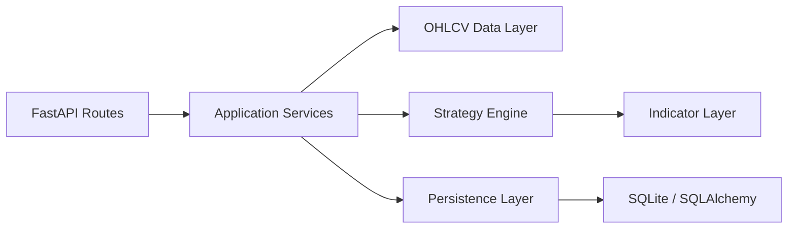

# System Design

## Overview

`trading-assistant` is a rule-based, multi-timeframe trading analysis backend. It does not place orders or use trading API keys. Its job is to ingest real OHLCV market data, compute indicators, apply the current mainline swing strategy `swing_trend_long_regime_gate_v1`, and return a structured trading conclusion with reasoning and risk levels.

The current implementation is intentionally deterministic:

- Rule engine and scorecard decide the final action.
- LLMs are not part of the decision path.
- The API returns structured JSON so the result can be audited, stored, and replayed.

## Architecture

### Layers

- `app/api/`: HTTP endpoints and dependency wiring.
- `app/services/`: request orchestration and use-case boundaries.
- `app/data/`: ccxt exchange client and OHLCV retrieval.
- `app/indicators/`: EMA, ATR, swing, and structure utilities.
- `app/strategies/`: current mainline and research profiles, config loading, and scorecard logic.
- `app/schemas/`: request/response/result models.
- `app/models/`: SQLAlchemy persistence model.
- `app/core/`: settings, logging, database bootstrap, and typed errors.
- `app/vision/`: placeholder for future chart-image analysis adapters.
- `app/notifications/`: placeholder for future push/alert adapters.

## Data Flow

1. Client submits `POST /analyze`.
2. `AnalyzeRequest` validates symbol, exchange, timeframes, strategy profile, and lookback.
3. `AnalysisService` fetches OHLCV for each requested timeframe.
4. `OhlcvService` uses `ExchangeClientFactory` to create a Binance USDT perpetual client via `ccxt.binanceusdm`.
5. The strategy enriches each timeframe with EMA, ATR, swing levels, EMA alignment, structure state, and trend strength.
6. The active strategy profile combines higher, setup, and trigger timeframe signals into:
   - `action`: `LONG`, `SHORT`, or `WAIT`
   - `bias`: `bullish`, `bearish`, or `neutral`
   - `confidence`: 0-100
   - entry/stop/invalidation/take-profit hints
   - explanations and risk notes
   - diagnostics such as score breakdown, vetoes, conflict signals, and trigger maturity
7. The full result is stored in SQLite and returned as JSON.

## Decision Logic

The current mainline swing strategy is a staged filter:

1. Higher timeframe regime:
   - `1D + 4H` determine directional environment.
   - Price above EMA200 with bullish EMA stacking implies bullish regime.
   - Price below EMA200 with bearish EMA stacking implies bearish regime.
   - Mixed EMA order or frequent EMA200 crossing implies neutral regime.
2. Middle timeframe location:
   - `1H` checks whether price is near the EMA21/EMA55 value area.
   - If price is too extended, the strategy prefers `WAIT`.
3. Setup and trigger confirmation:
   - `1H` requires reversal context plus trigger confirmation around `regained_fast + held_slow`.
   - If confirmation is missing or messy, the strategy falls back to `WAIT`.
4. Scorecard and veto conditions:
   - Higher-timeframe conflict, high volatility, missing confirmation, and structural noise reduce confidence.
   - The final action is conservative by design.

## Core Modules

### `app/data/exchange_client.py`

- Builds the ccxt client.
- Defaults to `binanceusdm`.
- Supports `trust_env`, explicit proxies, timeout, and sandbox mode.
- Designed so proxying can be configured without code changes.

### `app/data/ohlcv_service.py`

- Fetches OHLCV across supported timeframes.
- Retries transient network/exchange failures.
- Rejects unsupported timeframes and too-short histories.

### `app/indicators/*`

- `ema.py`: EMA 20/50/100/200.
- `atr.py`: ATR(14).
- `swings.py`: recent swing highs/lows.
- `market_structure.py`: EMA alignment, structure state, trend strength.

### `app/strategies/swing_trend_long_regime_gate_v1.py`

- Extends the shared windowed MTF engine with the current mainline gate set.
- Keeps `EMA21/55` pullback logic, stricter bullish regime filtering, and the validated trigger core.
- Works with the current asymmetric exit baseline used by offline backtests and walk-forward studies.
- Produces the final structured `AnalysisResult`.

### `app/services/persistence_service.py`

- Persists both the request snapshot and the full result JSON.
- Supports filtered history review by symbol, action, bias, strategy profile, and time range.

### `app/vision/base.py` and `app/notifications/base.py`

- Interfaces only.
- No runtime implementation yet.

## Persistence Model

The SQLite table `analysis_records` stores:

- `analysis_id`
- `created_at`
- `symbol`
- `exchange`
- `market_type`
- `strategy_profile`
- `action`
- `bias`
- `confidence`
- `summary`
- `request_payload`
- `result_payload`

This is enough to support history retrieval and later migration to PostgreSQL.

## Configuration

Runtime settings are controlled by environment variables:

- `DEFAULT_EXCHANGE`
- `DEFAULT_MARKET_TYPE`
- `DEFAULT_LOOKBACK`
- `DATABASE_URL`
- `STRATEGY_CONFIG_DIR`
- `CCXT_TIMEOUT_MS`
- `CCXT_MAX_RETRIES`
- `CCXT_RETRY_DELAY_MS`
- `CCXT_TRUST_ENV`
- `CCXT_HTTP_PROXY`
- `CCXT_HTTPS_PROXY`
- `CCXT_SOCKS_PROXY`
- `BINANCE_USE_SANDBOX`
- `BINANCE_HOSTNAME`

## Known Constraints

- Only Binance perpetual is implemented for market access.
- Multiple strategy profiles exist, but the current mainline is `swing_trend_long_regime_gate_v1`; older and more complex variants are retained as legacy or research branches.
- The system does not execute trades.
- The result schema is intentionally verbose for auditability, not minimal payload size.

## Extension Points

- Add more strategy profiles under `app/strategies/`.
- Add chart screenshot analysis through `app/vision/`.
- Add alert delivery through `app/notifications/`.
- Add new exchanges or market types through `app/data/`.
- Expand history and review endpoints without changing the strategy contract.
